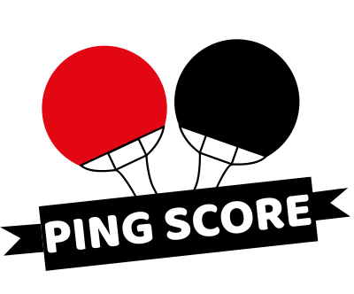

  # :ping_pong: [Ping Score](https://pingscore.ouiheberg.fr) :ping_pong:
  #### Projet Informatique Semestre 2 [IN'TECH NÎMES](https://www.intechinfo.fr/) en collaboration avec l'[ASPC Nîmes](http://www.aspcn.fr/)  
  ___
  > ##### Création d'une Application Web de Livescoring pour les Championnats de France Handisport de Tennis de Table des 14/15/16 juin 2019 à Nîmes. 
  ___
  
  
  

## Construit avec

* [Bootstrap](https://getbootstrap.com) - CSS framework
* [Composer](https://getcomposer.org/) - Gestionnaire de dépendances
* [Phpspreadsheet](https://phpspreadsheet.readthedocs.io) - Bibliothèque PHP pour lire et écrire des fichiers tableurs
* [jQuery](https://jquery.com/) - jQuery JavaScript Library 
* [DataTables](https://datatables.net/) - Tables Plug-in pour jQuery
* [Toastr](http://www.toastrjs.com) - Simple notification toast en JavaScirpt

## Versioning

Pour les versions disponibles, voir les [tags de ce répertoire](https://github.com/Lacaravaneducodeur/PingScore/releases). 

## Auteurs

* **Luc NICOLAS** - *Développement* - [lucnicolas](https://github.com/lucnicolas)
* **Hugo MARTI** - *Webdesign* - [h-marti](https://github.com/h-marti)

Voir aussi la liste des [contributeurs](https://github.com/Lacaravaneducodeur/PingScore/graphs/contributors) qui ont participé à ce projet.

## Licence

Ce projet est sous licence GNU AGPL v3.0 - see the [LICENSE](LICENSE) file for details

## Partenaires

* [ASPC Nîmes](http://www.aspcn.fr) - Organisateur de l'évènement
* [Ouiheberg.fr](https://www.ouiheberg.com/) - Hébergeur Web

 

© 2019 [PingScore Team](https://github.com/Lacaravaneducodeur)
